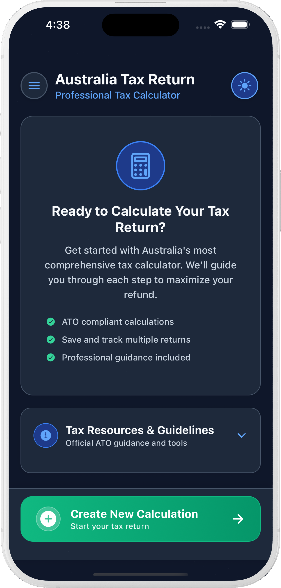
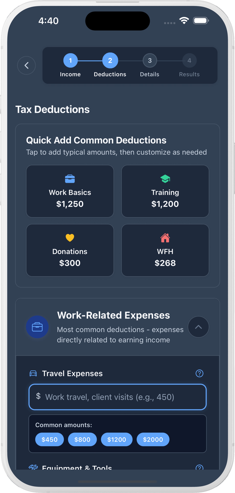

# My Tax Return Au

Australia Tax Return Calculator is a comprehensive mobile application designed to help Australian individuals quickly and accurately estimate their tax refunds or amounts owed to the Australian Taxation Office (ATO). Built with React Native and Expo, it provides a clean, intuitive interface that simplifies the complex process of tax calculations while maintaining accuracy with current Australian tax rates and regulations.

<table>
  <tr>
    <td></td>
    <td></td>
    <td></td>
  </tr>
</table>

## 🎯 Project Overview

This calculator eliminates the complexity of traditional tax estimation tools by providing:

- **Step-by-step guidance** through income, deductions, and personal details
- **Real-time validation** with helpful error messages and tips
- **Comprehensive calculations** using 2025-26 Australian tax brackets and rates
- **Professional reporting** with detailed breakdowns and PDF export capability
- **Smart estimation** features for unknown PAYG withholding amounts
- **Calculation history** with local storage for managing multiple tax calculations
- **Home screen dashboard** for easy access to saved calculations

## ✨ Key Features

### Tax Calculations

- **Income Tax Calculation** using 2025-26 Australian tax brackets
- **Low Income Tax Offset (LITO)** automatic application
- **Medicare Levy** calculation (2% of taxable income)
- **HECS-HELP Repayment** calculations based on income thresholds
- **Work from Home Deductions** using ATO-approved rates ($0.70/hour)
- **Multiple Income Sources** support (employment + ABN income)
- **PAYG Withholding Estimation** for unknown tax withheld amounts

### User Experience

- **4-Step Wizard Interface** with progress tracking
- **Input Validation** with real-time error checking
- **Contextual Help System** with detailed explanations for each field
- **Professional Loading Animation** during calculations
- **Success Notifications** with smooth animations
- **PDF Report Generation** for record keeping

### Smart Features

- **Auto-calculation** of work from home deductions
- **Dynamic PAYG estimation** based on total income
- **Multiple job income** support with easy add/remove functionality
- **Dependent-based** Medicare levy adjustments
- **Comprehensive validation** preventing calculation errors

### Storage & Navigation

- **Home Screen Dashboard** displaying all saved calculations
- **Local Storage** using AsyncStorage for secure, offline data persistence
- **Calculation Management** with save, view, and delete functionality
- **Quick Access** to previous calculations with detailed summaries
- **Navigation System** between home screen and calculator with proper state management
- **Automatic Sorting** of saved calculations by date (newest first)

## 📋 Input Fields Documentation

### Step 1: Income Information

#### Employment Income (TFN Jobs)

- **Field**: `jobIncomes` (Array of monetary values)
- **Format**: Monetary values with `$` prefix
- **Purpose**: Gross annual salary/wages from employment where tax was withheld using TFN
- **Validation**: Must be positive numbers
- **Examples**:
  - Full-time salary: $75,000
  - Part-time wages: $35,000
  - Multiple jobs: Add each separately
- **Tips**: Use gross income before tax, include bonuses and overtime

#### Tax Withheld (PAYG)

- **Field**: `taxWithheld`
- **Format**: Monetary value with `$` prefix
- **Purpose**: Total amount of tax withheld by employers from TFN employment income only
- **Validation**: Must be positive number, cannot exceed reasonable percentage of employment income
- **Source**: Payment summaries, payslips, or PAYG summaries
- **Smart Feature**: Auto-estimation available based on TFN employment income only
- **Important**: PAYG estimation excludes ABN income as no tax is withheld from business income

#### ABN/Business Income

- **Field**: `abnIncome`
- **Format**: Monetary value with `$` prefix
- **Purpose**: Income from ABN work, contracting, or business activities
- **Validation**: Must be positive number
- **Note**: No tax is withheld from this income type - handled through quarterly BAS or annual tax return

### Step 2: Deductions

#### Work-Related Expenses

- **Field**: `deductions.workRelated`
- **Format**: Monetary value with `$` prefix
- **Purpose**: Job-related expenses like uniforms, tools, professional development
- **Validation**: Must be positive number
- **Examples**: Safety equipment, professional memberships, work clothing

#### Self-Education Expenses

- **Field**: `deductions.selfEducation`
- **Format**: Monetary value with `$` prefix
- **Purpose**: Education costs directly related to current work
- **Validation**: Must be positive number
- **Examples**: Courses, textbooks, professional certifications

#### Charitable Donations

- **Field**: `deductions.donations`
- **Format**: Monetary value with `$` prefix
- **Purpose**: Donations to registered charities (DGR status required)
- **Validation**: Must be positive number
- **Requirement**: Must have receipts for donations over $2

#### Other Deductions

- **Field**: `deductions.other`
- **Format**: Monetary value with `$` prefix
- **Purpose**: Other allowable tax deductions
- **Validation**: Must be positive number
- **Examples**: Investment property expenses, tax agent fees

#### Work From Home Hours

- **Field**: `workFromHomeHours`
- **Format**: Numeric value with `hrs` suffix
- **Purpose**: Total hours worked from home during the financial year
- **Validation**: Must be positive number, reasonable for work schedule
- **Calculation**: Automatically multiplied by $0.70 per hour (ATO fixed rate)
- **Examples**:
  - Full-time WFH: 1,800-2,000 hours
  - Part-time WFH: 900-1,000 hours

### Step 3: Personal Details

#### HECS-HELP Debt

- **Field**: `hecsDebt` (Boolean toggle)
- **Purpose**: Indicates if you have outstanding HECS-HELP debt
- **Impact**: Triggers additional repayment calculations based on income thresholds
- **Rates**: Progressive rates from 1% to 10% based on income levels

#### Medicare Levy Exemption

- **Field**: `medicareExemption` (Boolean toggle)
- **Purpose**: Indicates eligibility for Medicare levy exemption
- **Default**: Medicare levy applied (2% of taxable income)
- **Exemptions**: Foreign residents, temporary visa holders, Norfolk Island residents
- **Help**: Comprehensive help available explaining eligibility criteria

#### Number of Dependents

- **Field**: `dependents`
- **Format**: Numeric value (whole numbers)
- **Purpose**: Number of dependent children or family members
- **Impact**: Increases Medicare levy threshold by $4,216 per dependent
- **Thresholds**: Base $27,222, Family starts at $45,907
- **Validation**: Must be non-negative integer

## 🧮 Calculation Methods

### Tax Calculation Process

#### 1. Income Aggregation

```
Total Income = Sum of Employment Income + ABN Income
```

#### 2. Deduction Calculation

```
Work From Home Deduction = Work From Home Hours × $0.70
Total Deductions = Work Related + Self Education + Donations + Other + WFH Deduction
```

#### 3. Taxable Income

```
Taxable Income = Max(0, Total Income - Total Deductions)
```

#### 4. Income Tax Calculation (2025-26 Tax Brackets)

- **$0 - $18,200**: 0% (Tax-free threshold)
- **$18,201 - $45,000**: 16%
- **$45,001 - $135,000**: 30%
- **$135,001 - $190,000**: 37%
- **$190,001+**: 45%

#### 5. Low Income Tax Offset (LITO)

- **Up to $37,500**: $700 offset
- **$37,501 - $45,000**: $700 - ((income - $37,500) × 5%)
- **$45,001 - $66,667**: $325 - ((income - $45,000) × 1.5%)
- **$66,668+**: No offset

#### 6. Medicare Levy

- **Rate**: 2% of taxable income
- **Base Threshold**: $27,222 (2024-25 threshold applies to later years until replaced)
- **Family Threshold**: $45,907 + ($4,216 × dependents)
- **Phase-in**: 10c for each $1 above the relevant low-income threshold, capped at 2% of taxable income
- **Exemptions**: Available for foreign residents and certain visa holders

#### 7. HECS-HELP Repayment

From 2025-26, compulsory repayments use marginal rates:

- **$0 - $67,000**: Nil
- **$67,001 - $125,000**: 15c for each $1 over $67,000
- **$125,001 - $179,285**: $8,700 plus 17c for each $1 over $125,000
- **$179,286+**: 10% of total repayment income

#### 8. Final Calculation

```
Final Tax = Income Tax - LITO + Medicare Levy + HECS Repayment
Tax Refund/Owing = Tax Withheld - Final Tax
```

### PAYG Estimation Algorithm

When tax withheld is unknown, the app estimates based on **TFN employment income only** (excludes ABN income):

- **Up to $18,200**: 0% withholding
- **$18,201 - $45,000**: 16% withholding
- **$45,001 - $135,000**: 30% withholding (on amount over $45,000)
- **$135,001 - $190,000**: 37% withholding (on amount over $135,000)
- **$190,001+**: 45% withholding (on amount over $190,000)

Plus estimated Medicare levy (2% for TFN income over $27,222).

**Important**: ABN/business income is excluded from PAYG estimation as employers don't withhold tax from business income.

## 🚀 Installation and Setup

### Prerequisites

- Node.js (v16 or higher)
- npm or yarn package manager
- Expo CLI (optional but recommended)

### Installation Steps

1. **Clone the repository**

   ```bash
   git clone <repository-url>
   cd TaxReturnCalculator
   ```

2. **Install dependencies**

   ```bash
   npm install
   ```

3. **Start the development server**

   ```bash
   npm start
   # or
   expo start
   ```

4. **Run on device/simulator**
   - **iOS**: Press `i` in terminal or scan QR code with Camera app
   - **Android**: Press `a` in terminal or scan QR code with Expo Go app
   - **Web**: Press `w` in terminal to open in browser

### Development Setup

For development with hot reloading:

```bash
expo start --dev-client
```

For EAS preview and store builds:

```bash
npm run eas:whoami
npm run eas:build:ios:preview-simulator
npm run eas:build:android:preview
npm run eas:build:ios:production
npm run eas:build:android:production
```

The iOS preview simulator build does not require Apple signing credentials. Internal iOS device
builds and production store builds require an Expo account plus Apple Developer Program or Google
Play Console credentials.

## 🛠️ Development Guide

### Project Architecture

The application follows modern React Native best practices with a modular architecture:

#### **Folder Structure Explained**

- **`src/components/`**: Reusable UI components
  - `forms/`: Form-specific components (InputField, etc.)
  - `ui/`: General UI components (modals, toggles, etc.)
  - `common/`: Shared components used across the app

- **`src/services/`**: Business logic layer
  - `taxCalculationService.js`: Core tax calculation engine
  - `storageService.js`: Data persistence and retrieval
  - `pdfService.js`: PDF generation and sharing

- **`src/utils/`**: Pure utility functions
  - `formatters.js`: Currency, date, and number formatting
  - `validation.js`: Form validation with error messages
  - `helpers.js`: General utility functions

- **`src/constants/`**: Configuration and static data
  - `taxConstants.js`: Tax brackets, rates, and thresholds
  - `helpText.js`: All contextual help content
  - `themes.js`: Light and dark theme definitions
  - `appConstants.js`: General app configuration

#### **Adding New Features**

1. **New Components**: Add to appropriate subfolder in `src/components/`
2. **Business Logic**: Add to `src/services/` with proper separation
3. **Utilities**: Add pure functions to `src/utils/`
4. **Constants**: Add configuration to `src/constants/`
5. **Tests**: Add tests to `src/__tests__/` following existing patterns

#### **Code Style Guidelines**

- Use functional components with hooks
- Implement proper error handling
- Add comprehensive JSDoc comments
- Follow the existing naming conventions
- Ensure all new code has corresponding tests

## 📱 Usage Instructions

### Step-by-Step Guide

#### Step 1: Income Information

1. **Enter Employment Income**: Add your gross annual salary from each job
   - Use the "+" button to add multiple jobs
   - Enter amounts without commas (e.g., 75000 not 75,000)
   - Include bonuses, overtime, and allowances

2. **Enter Tax Withheld**: Input total PAYG tax withheld
   - Find this on your payment summary
   - If unknown, use the "Estimate PAYG" feature
   - Validation ensures reasonable amounts

3. **Add ABN Income** (if applicable): Enter business/contracting income
   - This is typically income without tax withheld
   - Include all ABN-related earnings

#### Step 2: Deductions

1. **Work-Related Expenses**: Enter job-related costs
   - Must be directly related to earning income
   - Keep receipts for amounts over $300

2. **Self-Education**: Add education expenses
   - Must relate to current work or improve skills
   - Include course fees, textbooks, travel

3. **Charitable Donations**: Enter donation amounts
   - Must be to registered DGR charities
   - Receipts required for donations over $2

4. **Work From Home**: Enter total hours worked from home
   - App automatically calculates deduction at $0.70/hour
   - Based on ATO simplified method

#### Step 3: Personal Details

1. **HECS-HELP Debt**: Toggle if you have student debt
   - Affects repayment calculations
   - Based on income thresholds

2. **Medicare Levy Exemption**: Check if you qualify for exemption
   - 2% of taxable income for most residents
   - Exemptions for foreign residents and certain visa holders
   - Comprehensive help available explaining eligibility

3. **Dependents**: Enter number of dependent children
   - Increases Medicare levy threshold by $4,216 per dependent
   - Family threshold starts at $45,907 for first dependent

#### Step 4: Results

- **Review Calculation**: Detailed breakdown of all components
- **Export PDF**: Generate professional report
- **Share Results**: Export for record keeping or professional review

### Navigation Tips

- Use **Next/Previous** buttons to navigate between steps
- **Help icons** provide detailed explanations for each field
- **Validation errors** appear in real-time with helpful guidance
- **Progress indicator** shows current step and completion status

## 🛠 Technology Stack

### Core Framework

- **React Native**: Cross-platform mobile development
- **Expo**: Development platform and build tools
- **React**: Component-based UI library

### UI/UX Libraries

- **@expo/vector-icons**: Icon library (Ionicons)
- **expo-linear-gradient**: Gradient backgrounds
- **expo-status-bar**: Status bar management

### File Management

- **expo-file-system**: File system access for PDF generation
- **expo-sharing**: Native sharing capabilities

### Development Tools

- **Metro**: JavaScript bundler
- **Babel**: JavaScript compiler
- **ESLint**: Code linting (implied)

### Key Dependencies

```json
{
  "expo": "^53.0.0",
  "react": "19.0.0",
  "react-native": "0.79.5",
  "expo-linear-gradient": "~14.1.5",
  "@expo/vector-icons": "^14.0.0",
  "expo-file-system": "~18.1.11",
  "expo-sharing": "~13.1.5"
}
```

## 🎨 Design & Component System

### Visual Design

- **Modern Interface**: Clean, professional design following Material Design principles
- **Dark/Light Theme Support**: Automatic system theme detection with manual override
- **Responsive Layout**: Optimized for various screen sizes and orientations
- **Intuitive Navigation**: Clear step progression with visual indicators
- **Professional Color Scheme**: ATO-inspired blue theme with accessibility considerations

### User Experience

- **Progressive Disclosure**: Information revealed step-by-step to avoid overwhelming users
- **Contextual Help**: Detailed explanations available for every input field with smart suggestions
- **Real-time Feedback**: Immediate validation and calculation updates
- **Error Prevention**: Comprehensive input validation prevents common mistakes
- **Professional Output**: Clean, detailed PDF reports suitable for record-keeping
- **Smart Input Features**: Auto-formatting, suggestions, and validation feedback

### Component Architecture

The app uses a modular component system for consistency and maintainability:

#### **InputField Component** (`src/components/forms/InputField.js`)

- Smart validation with real-time feedback
- Contextual help integration with detailed explanations
- Auto-formatting for currency and numbers
- Smart suggestions based on field type
- Accessibility support with proper labels
- Prefix/suffix support ($ for currency, hrs for time)

#### **HelpModal Component** (`src/components/ui/HelpModal.js`)

- Comprehensive help system with examples and tips
- Structured information display with clear sections
- Easy-to-understand explanations for complex tax concepts
- "Where to find" guidance for each field

#### **Theme System** (`src/context/ThemeContext.js`)

- Automatic dark/light mode detection
- Consistent color schemes across all components
- User preference persistence with AsyncStorage
- Smooth theme transitions

## 📁 Project Structure

The application follows a modular, maintainable architecture with clear separation of concerns:

```
TaxReturnCalculator/
├── App.js                    # Entry point (imports from src/)
├── index.js                  # Expo app registration
├── package.json              # Dependencies and scripts
├── README.md                 # Project documentation
├── src/                      # Main source code
│   ├── App.js               # Main application component
│   ├── components/          # Reusable UI components
│   │   ├── common/         # Generic components
│   │   ├── forms/          # Form-related components
│   │   │   └── InputField.js    # Smart input with validation & help
│   │   └── ui/             # UI-specific components
│   │       ├── HelpModal.js     # Contextual help modal
│   │       └── ThemeToggle.js   # Theme switching component
│   ├── screens/            # Screen components
│   │   ├── HomeScreen.js        # Dashboard with saved calculations
│   │   └── SplashScreen.js      # Loading screen
│   ├── services/           # Business logic layer
│   │   ├── taxCalculationService.js  # Tax calculation engine
│   │   ├── storageService.js         # Data persistence
│   │   └── pdfService.js            # PDF generation
│   ├── utils/              # Utility functions
│   │   ├── formatters.js        # Currency, date, number formatting
│   │   ├── validation.js        # Form validation functions
│   │   └── helpers.js           # General utility functions
│   ├── constants/          # Configuration and constants
│   │   ├── helpText.js          # All help text data
│   │   ├── taxConstants.js      # Tax brackets, rates, thresholds
│   │   ├── themes.js            # Light/dark theme definitions
│   │   └── appConstants.js      # General app configuration
│   ├── context/            # React context providers
│   │   └── ThemeContext.js      # Theme management
│   ├── hooks/              # Custom React hooks (ready for future use)
│   └── __tests__/          # Test files
│       ├── tax-calculator-tests.js  # Comprehensive test suite
│       └── run-tests.js             # Test runner
└── node_modules/           # Installed dependencies
```

### Architecture Overview

#### 🏗️ **Modular Design**

The application is organized into distinct layers for maximum maintainability:

- **Components Layer**: Reusable UI components with clear interfaces
- **Services Layer**: Business logic separated from UI concerns
- **Utils Layer**: Pure functions for common operations
- **Constants Layer**: Centralized configuration and data
- **Context Layer**: Global state management

#### 🔧 **Key Components**

**Core Components:**

- `InputField`: Smart input component with validation, help system, and formatting
- `HelpModal`: Comprehensive help system with detailed explanations
- `ThemeToggle`: Theme switching with system preference detection

**Services:**

- `taxCalculationService`: Complete tax calculation engine with 2025-26 rates
- `storageService`: Secure local data persistence using AsyncStorage
- `pdfService`: Professional PDF report generation and sharing

**Utilities:**

- `formatters`: Currency, date, and number formatting functions
- `validation`: Comprehensive form validation with error messages
- `helpers`: General utility functions for common operations

#### 📊 **Testing Infrastructure**

- **Comprehensive Test Suite**: 30+ tests covering all calculation scenarios
- **Integration Tests**: End-to-end calculation validation
- **Edge Case Testing**: Boundary conditions and error handling
- **Automated Test Runner**: Custom test runner with detailed reporting

### State Management

The application uses a hybrid approach for state management:

- **Local State**: React hooks (useState, useEffect) for component-specific state
- **Global State**: React Context for theme management and app-wide settings
- **Form Data**: Individual useState hooks for each input category with proper validation
- **Navigation**: Step tracking and validation states with persistence
- **UI State**: Loading, animations, and modal visibility
- **Data Persistence**: AsyncStorage for saved calculations and user preferences

### Development Workflow

1. **Code Organization**: Follow the modular structure with clear separation of concerns
2. **Component Development**: Create reusable components with proper prop interfaces
3. **Service Layer**: Implement business logic in services with comprehensive error handling
4. **Testing**: Write tests for all new functionality following existing patterns
5. **Documentation**: Update help text and documentation for new features

## 🎨 UI Design Patterns

### Color Scheme

- **Primary**: Blue gradient (#4A90E2 to #2C5F8C)
- **Success**: Green (#28a745)
- **Error**: Red (#FF6B6B)
- **Warning**: Orange (#FFA500)
- **Text**: Dark gray (#333) and light gray (#666)

### Button Styling (Per User Preferences)

- **Next Buttons**: Black background, larger size
- **Previous/Back Buttons**: Grey background, standard size
- **Calculate Buttons**: Accent color (blue), larger size

### Input Field Features

- **Monetary Fields**: Automatic `$` prefix
- **Time Duration Fields**: Automatic `hrs` suffix
- **Icons**: Contextual Ionicons for each field type
- **Help System**: Integrated help with detailed explanations
- **Validation**: Real-time error display with helpful messages

### Responsive Design

- **KeyboardAvoidingView**: Handles keyboard overlap
- **ScrollView**: Smooth scrolling for long forms
- **Flexible Layouts**: Adapts to different screen sizes
- **Touch Targets**: Optimized for mobile interaction

## 🧪 Testing

### Automated Test Suite

The application includes a comprehensive test suite with **30+ tests** covering all calculation scenarios:

#### Running Tests

```bash
# Run all tests
npm test

# Run tests with detailed HTML report
npm run test:report
```

#### Test Coverage

**✅ Complete Tax Calculation Integration Tests**

- Standard income scenarios with various deduction combinations
- Edge cases: Very high income with maximum deductions
- Medicare exemption scenarios
- Multiple income source calculations

**✅ Field Validation and Edge Cases**

- Empty string inputs handled correctly
- Multiple job incomes calculation
- ABN income only scenarios
- Input validation and error handling

**✅ Boundary Value Tests**

- Tax bracket boundaries (18200, 45000, 135000, 190000)
- Medicare levy thresholds
- LITO (Low Income Tax Offset) boundaries
- HECS-HELP repayment thresholds

**✅ PAYG Estimation Tests**

- Accurate withholding estimation for TFN employment income
- Proper exclusion of ABN income from PAYG calculations
- Edge cases and boundary conditions

#### Test Results Summary

- **Total Tests**: 30
- **Pass Rate**: 100% ✅
- **Coverage**: All major calculation paths and edge cases
- **Automated**: Runs on every code change

### Manual Testing Checklist

#### Input Validation Testing

- [ ] Test negative income values (should be rejected)
- [ ] Test extremely large income values (should be reasonable)
- [ ] Test non-numeric inputs (should be filtered)
- [ ] Test PAYG withholding exceeding income (should warn)
- [ ] Test work from home hours exceeding reasonable limits

#### User Experience Testing

- [ ] Test step navigation (forward/backward)
- [ ] Test form persistence between steps
- [ ] Test help modal functionality
- [ ] Test PDF generation and sharing
- [ ] Test theme switching (light/dark mode)
- [ ] Test calculation saving and loading

#### Cross-Platform Testing

- [ ] Test on iOS devices/simulator
- [ ] Test on Android devices/emulator
- [ ] Test on different screen sizes
- [ ] Test keyboard behavior and input focus

## ⚠️ Important Notes

### Accuracy and Limitations

- **Estimates Only**: Results are estimates and should not replace advice from a registered tax agent
- **2025-26 Rates**: Uses current Australian tax rates and thresholds
- **Simplified Calculations**: Some complex scenarios may require professional consultation
- **ATO Source Notes**: Supported tax-year assumptions are source-linked but may not cover all edge cases

### Data Privacy

- **Local Saved Data**: Saved calculations are stored locally on the device
- **Optional Diagnostics**: Preview and production builds can enable analytics or crash reporting through environment configuration
- **Export Control**: Reports leave the device only when the user chooses to export or share them

### Professional Advice

Users should consult qualified tax professionals for:

- Complex investment scenarios
- Business tax obligations
- Capital gains calculations
- International tax implications
- Official tax return lodgment

## 📄 License

This project is for educational and estimation purposes only. Users should consult a registered tax agent or official ATO services for actual tax return preparation.

---

**MyTaxReturn AU** - Simplifying Australian tax calculations with accuracy and ease.
